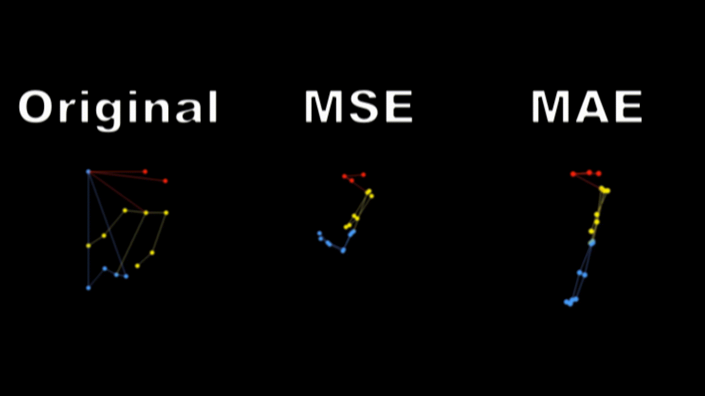

# Fall-Detection using LSTM Autoencoder v1.2.1
<!--
*** Thanks for checking out the Best-README-Template. If you have a suggestion
*** that would make this better, please fork the repo and create a pull request
*** or simply open an issue with the tag "enhancement".
*** Thanks again! Now go create something AMAZING! :D
***
***
***
*** To avoid retyping too much info. Do a search and replace for the following:
*** github_username, repo_name, twitter_handle, email, project_title, project_description
-->


<!-- PROJECT SHIELDS -->
<!--
*** I'm using markdown "reference style" links for readability.
*** Reference links are enclosed in brackets [ ] instead of parentheses ( ).
*** See the bottom of this document for the declaration of the reference variables
*** for contributors-url, forks-url, etc. This is an optional, concise syntax you may use.
*** https://www.markdownguide.org/basic-syntax/#reference-style-links
-->
[![Contributors][contributors-shield]][contributors-url]
[![Issues][issues-shield]][issues-url]
[![LinkedIn][linkedin-shield]][linkedin-url]


<!-- PROJECT LOGO -->
<br />
<p align="center">
  <a href="https://github.com/github_username/repo_name">
    
  </a>

  <h3 align="center">Abstract</h3>

  <p align="justify">
Even if it's not well known, falling is one of the causes for accidental injury for most of the elderly people over 65 years old. If the fall incidents are not detected in a timely manner, they could lead to serious injury. Moreover, such incidents can happen in outdoor environments, such as parking lots, where the probability of being noticed and receive punctual help is even smaller. A system which detects abnormal events (such as falls) only using camera streams, without requiring extra sensors, could provide timely aid by triggering an alarm. In this work, we provide a solution using an LSTM Autoencoder which is one of the most used machine learning algorithm for anomaly detection. After applying a real-time pose estimation framework, called OpenPose, to the real-time video source, the poses are preprocessed by different steps in order to be normalized and filtered, and then processed by an LSTM Autoencoder. The model is trained to learn the normal behaviour of a walking person through a large dataset of 19 joint points of human body. If the autoencoder generates an output which is too different from the corrispondent input, it means that the time window that was given to the model is an anomaly, meaning the person is falling.
    <br />
  </p>
  <p align="center">
    <a href="https://github.com/github_username/repo_name">View Demo</a>
    ·
    <a href="https://github.com/github_username/repo_name/issues">Report Bug</a>
    ·
    <a href="https://github.com/github_username/repo_name/issues">Request Feature</a>
  </p>
</p>




<!-- TABLE OF CONTENTS -->
<details open="open">
  <summary><h2 style="display: inline-block">Table of Contents</h2></summary>
  <ol>
    <li>
      <a href="#about-the-project">About The Project</a>
      <ul>
        <li><a href="#built-with">Built With</a></li>
      </ul>
    </li>
    <li>
      <a href="#getting-started">Getting Started</a>
      <ul>
        <li><a href="#prerequisites">Prerequisites</a></li>
      </ul>
    </li>
    <li><a href="#contact">Contact</a></li>
    <li><a href="#acknowledgements">Acknowledgements</a></li>
  </ol>
</details>


<!-- ABOUT THE PROJECT -->
## About The Project

[![Product Name Screen Shot][product-screenshot]](https://example.com)

Here's a blank template to get started:
**To avoid retyping too much info. Do a search and replace with your text editor for the following:**
`github_username`, `repo_name`, `twitter_handle`, `email`, `project_title`, `project_description`


### Built With

* []()
* []()
* []()


<!-- GETTING STARTED -->
## Getting Started

To get a local copy up and running follow these simple steps.

### Prerequisites

This is an example of how to list things you need to use the software and how to install them.
* npm
  ```sh
  npm install npm@latest -g
  ```


<!-- CONTACT -->
## Contact

Your Name - [@twitter_handle](https://twitter.com/twitter_handle) - email

Project Link: [https://github.com/github_username/repo_name](https://github.com/github_username/repo_name)


<!-- ACKNOWLEDGEMENTS -->
## Acknowledgements

* []()
* []()
* []()


<!-- MARKDOWN LINKS & IMAGES -->
<!-- https://www.markdownguide.org/basic-syntax/#reference-style-links -->
[contributors-shield]: https://img.shields.io/github/contributors/github_username/repo.svg?style=for-the-badge
[contributors-url]: https://github.com/github_username/repo/graphs/contributors
[issues-shield]: https://img.shields.io/github/issues/github_username/repo.svg?style=for-the-badge
[issues-url]: https://github.com/github_username/repo/issues
[linkedin-shield]: https://img.shields.io/badge/-LinkedIn-black.svg?style=for-the-badge&logo=linkedin&colorB=555
[linkedin-url]: https://linkedin.com/in/github_username
